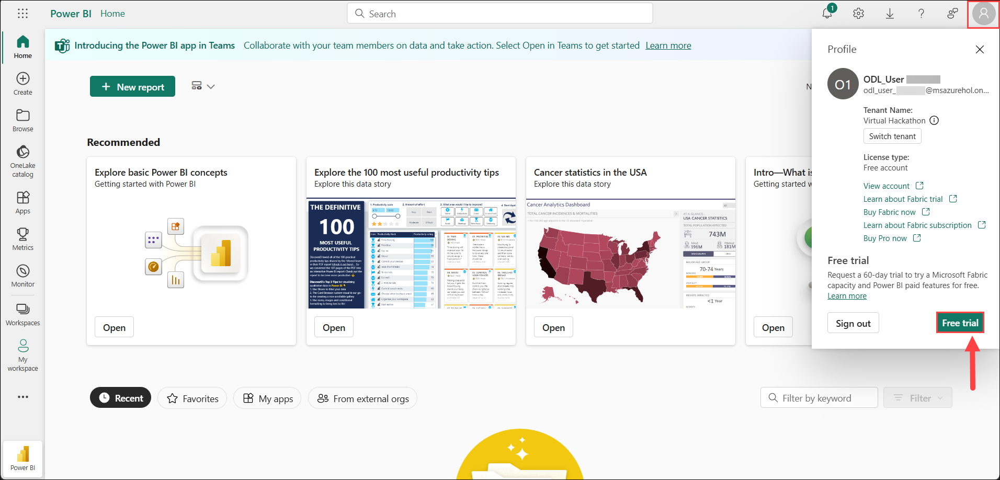
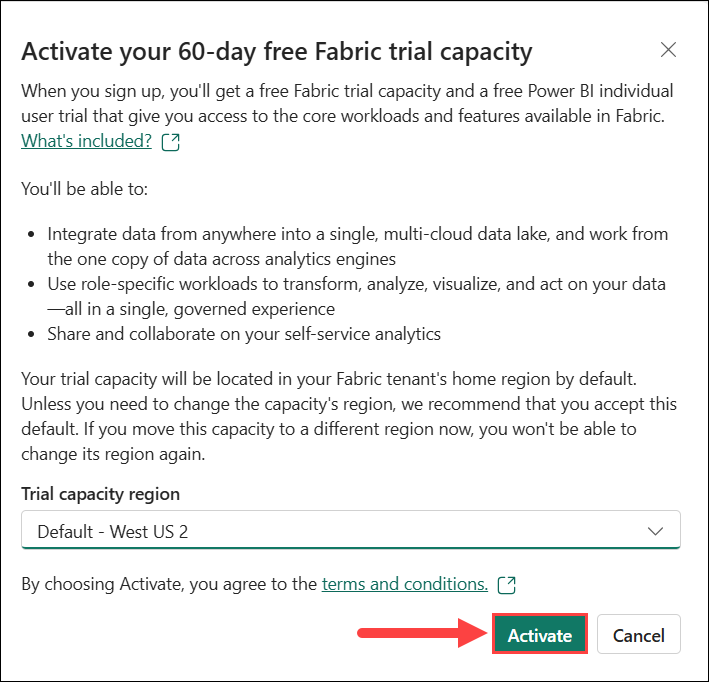
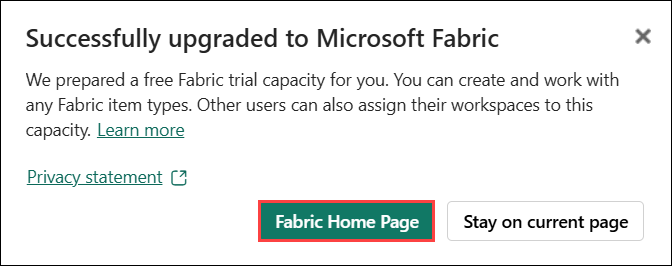
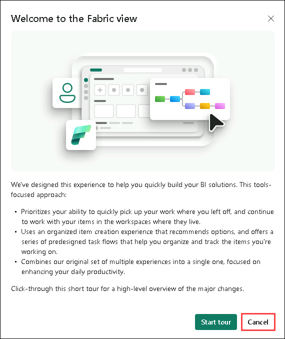
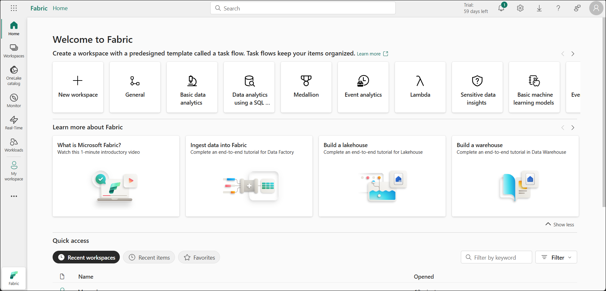

# **Advanced Analytics: From Models to Outcomes with Microsoft Fabric - Lab 1**

## Contents

- Introduction
- Task 1 - Getting Started with Microsoft Fabric: Activate Trial and Set Up a Workspace
- Task 2 - Data Science in Fabric
    - Task 2.1 - Data Science in Fabric (Notebook Setup)
    - Task 2.2 - Data Science in Fabric (Continued)
- Summary

## Introduction

In this lab, you will begin an end-to-end Data Science workflow using Microsoft Fabric. The goal is to build a predictive model that determines whether bank customers are likely to churn, i.e., stop doing business with the bank. You'll walk through each phase of the workflow, from installing necessary libraries to training machine learning models and visualizing results in Power BI.

By the end of this lab, you’ll have a solid foundation for performing data science tasks in Microsoft Fabric, using tools like Data Wrangler, scikit-learn, LightGBM, MLflow, and built-in visualization features.

.png)

## Task 1: Getting Started with Microsoft Fabric: Activate Trial and Set Up a Workspace

1. In the top-right corner of Power BI, click the **User icon**, then select **Free trial** from the menu.

    

1. On Activate your 60-day free Fabric trial capacity dialog opens. Select **Activate**.

    

1. On Successfully upgraded to Microsoft Fabric dialog opens. Select **Fabric Home Page**.

    

1. On Welcome to the Fabric view dialog opens, click **Cancel**.

    

1. You will be navigated to the **Microsoft** **Fabric Home page**.

    

1. On the **Microsoft Fabric Home** page, click **+ New workspace** to create a new workspace.

    .png)

3. Enter the workspace name as **ws-<inject key="Deployment ID" enableCopy="false"/>**, then click or expand **Advanced** to assign the license mode for the Fabric workload.

    .png)

4. Choose **Fabric capacity** and select the available Capacity from the dropdown list. If no Fabric Capacity license is available.
    
5. For the **Semantic model storage format**, select **Large Semantic model storage format**, then click **Apply**. 

    > **Note:** Enabling the **Large semantic model storage format** in Premium capacities allows semantic models to exceed default size limits, with the maximum size determined by the capacity or admin settings.

    .png)

    > **Note:** If a task flows preview feature notification appears, click **Got it** to proceed. 

    .png)

## Task 2 - Data Science in Fabric

## Task 2.1 - Data Science in Fabric (Notebook Setup)

1. Click **Workloads** in the left navigation menu and select **Data Science**.

    .png)

2. Select **Explore a Sample**.
    
    .png)

3. Select the **Customer churn** sample, from the default **End-to-end workflows (Python)** tab.

    .png)
    
4. After successful creation of sample notebook, you may explore the tour by clicking **Show me** or **Skip tour**.

    .png)

5. In the **Explorer** pane, under the **Data items** tab, click **Add data items**. From the dropdown menu, select **New lakehouse**.

    .png)

7. Enter **CustomersLH** as the name for the **New lakehouse**, then click **Create**.

    > **Note:** You do not need to select the **Lakehouse Schemas (Public Preview)** checkbox.

    .png)

8. Now, your sample notebook is ready for execution.

    .png)

## Task 2.2 - Data Science in Fabric (Continued)

Follow the steps below to continue with the exercise. In this section, you will run the cells in the notebook sequentially.

### **Step 1: Install custom libraries (Ctrl + Enter or Press Run cell icon next to the cell)**

For machine learning model development or ad-hoc data analysis, you might need to quickly install a custom library for your Apache Spark session. You have two options to install libraries.

- Use the inline installation capabilities (`%pip` or `%conda`) of your notebook to install a library, but only in your current notebook.
- Alternatively, you can create a Fabric environment, install libraries from public sources or upload custom libraries to it, and then your workspace admin can attach the environment as the default for the workspace. All the libraries in the environment will then become available for use in any notebooks and Spark job definitions in the workspace. For more information on environments, see [create, configure, and use an environment in Microsoft Fabric](https://aka.ms/fabric/create-environment).

    For this tutorial, use `%pip install` to install the `imblearn` library in your notebook.

     Note: The PySpark kernel restarts after `%pip install` runs. Install the needed libraries before you run any other cells.

    PythonCopy

    ```python
    # Use pip to install libraries
    %pip install imblearn
    ```

    .png)

### **Step 2: Load the data (Ctrl + Enter or Press Run cell icon next to the cell)**

The dataset in _churn.csv_ contains the churn status of 10,000 customers, along with 14 attributes that include:

- Credit score
- Geographical location (Germany, France, Spain)
- Gender (male, female)
- Age
- Tenure (number of years the person was a customer at that bank)
- Account balance
- Estimated salary
- Number of products that a customer purchased through the bank
- Credit card status (whether or not a customer has a credit card)
- Active member status (whether or not the person is an active bank customer)

The dataset also includes row number, customer ID, and customer surname columns. Values in these columns shouldn't influence a customer's decision to leave the bank.

A customer bank account closure event defines the churn for that customer. The dataset `Exited` column refers to the customer's abandonment. Since we have little context about these attributes, we don't need background information about the dataset. We want to understand how these attributes contribute to the `Exited` status.

Out of those 10,000 customers, only 2037 customers (roughly 20%) left the bank. Because of the class imbalance ratio, we recommend generation of synthetic data. Confusion matrix accuracy might not have relevance for imbalanced classification. We might want to measure the accuracy using the Area Under the Precision-Recall Curve (AUPRC).

- This table shows a preview of the `churn.csv` data:

Expand table

|CustomerID|Surname|CreditScore|Geography|Gender|Age|Tenure|Balance|NumOfProducts|HasCrCard|IsActiveMember|EstimatedSalary|Exited|
|---|---|---|---|---|---|---|---|---|---|---|---|---|
|15634602|Hargrave|619|France|Female|42|2|0.00|1|1|1|101348.88|1|
|15647311|Hill|608|Spain|Female|41|1|83807.86|1|0|1|112542.58|0|

[](https://learn.microsoft.com/en-us/fabric/data-science/customer-churn#download-the-dataset-and-upload-to-the-lakehouse)

### **Download the dataset and upload to the lakehouse**

Define these parameters so that you can use this notebook with different datasets:

PythonCopy

```python
IS_CUSTOM_DATA = False  # If TRUE, the dataset has to be uploaded manually

IS_SAMPLE = False  # If TRUE, use only SAMPLE_ROWS of data for training; otherwise, use all data
SAMPLE_ROWS = 5000  # If IS_SAMPLE is True, use only this number of rows for training

DATA_ROOT = "/lakehouse/default"
DATA_FOLDER = "Files/churn"  # Folder with data files
DATA_FILE = "churn.csv"  # Data file name
```

This code downloads a publicly available version of the dataset, and then stores that dataset in a Fabric lakehouse:

PythonCopy

```python
import os, requests
if not IS_CUSTOM_DATA:
# With an Azure Synapse Analytics blob, this can be done in one line

# Download demo data files into the lakehouse if they don't exist
    remote_url = "https://synapseaisolutionsa.blob.core.windows.net/public/bankcustomerchurn"
    file_list = ["churn.csv"]
    download_path = "/lakehouse/default/Files/churn/raw"

    if not os.path.exists("/lakehouse/default"):
        raise FileNotFoundError(
            "Default lakehouse not found, please add a lakehouse and restart the session."
        )
    os.makedirs(download_path, exist_ok=True)
    for fname in file_list:
        if not os.path.exists(f"{download_path}/{fname}"):
            r = requests.get(f"{remote_url}/{fname}", timeout=30)
            with open(f"{download_path}/{fname}", "wb") as f:
                f.write(r.content)
    print("Downloaded demo data files into lakehouse.")
```

Start recording the time needed to run the notebook:

PythonCopy

```python
# Record the notebook running time
import time

ts = time.time()
```

[](https://learn.microsoft.com/en-us/fabric/data-science/customer-churn#read-raw-data-from-the-lakehouse)

### **Read raw data from the lakehouse**

Explore the downloaded raw data in Lakehouse under **Files -> churn -> raw -> churn.csv** 

.png)

> **Note:** If you don’t see the file, click the **Refresh** icon from the Lakehouse **ellipsis (...) menu** in the **Files** section.

.png)  

This code reads raw data from the **Files** section of the lakehouse, and adds more columns for different date parts. Creation of the partitioned delta table uses this information.

PythonCopy

```python
df = (
    spark.read.option("header", True)
    .option("inferSchema", True)
    .csv("Files/churn/raw/churn.csv")
    .cache()
)
```

[](https://learn.microsoft.com/en-us/fabric/data-science/customer-churn#create-a-pandas-dataframe-from-the-dataset)

### **Create a pandas DataFrame from the dataset**

This code converts the Spark DataFrame to a pandas DataFrame, for easier processing and visualization:

PythonCopy

```python
df = df.toPandas()
```

### **Step 3: Perform exploratory data analysis (Ctrl + Enter or Press Run cell icon next to the cell)**

### **Display raw data**

Explore the raw data with `display`, calculate some basic statistics, and show chart views. You must first import the required libraries for data visualization - for example, [seaborn](https://seaborn.pydata.org/). Seaborn is a Python data visualization library, and it provides a high-level interface to build visuals on dataframes and arrays.

PythonCopy

```python
import seaborn as sns
sns.set_theme(style="whitegrid", palette="tab10", rc = {'figure.figsize':(9,6)})
import matplotlib.pyplot as plt
import matplotlib.ticker as mticker
from matplotlib import rc, rcParams
import numpy as np
import pandas as pd
import itertools
```

PythonCopy

```python
display(df, summary=True)
```

### **Use Data Wrangler to perform initial data cleaning**

Launch Data Wrangler directly from the notebook to explore and transform pandas dataframes. At the notebook ribbon **Home** tab *(Data Wrangler is on the right of the Run all button)*, use the Data Wrangler dropdown prompt to browse the activated pandas DataFrames available for editing. Select the DataFrame you want to open in Data Wrangler.
 
> **Note:** Data Wrangler cannot be opened while the notebook kernel is busy. The cell execution must finish before you launch Data Wrangler. [Learn more about Data Wrangler](https://aka.ms/fabric/datawrangler).

.png)

After the Data Wrangler launches, a descriptive overview of the data panel is generated, as shown in the following images. The overview includes information about the dimension of the DataFrame, any missing values, etc. You can use Data Wrangler to generate the script to drop the rows with missing values, the duplicate rows and the columns with specific names. Then, you can copy the script into a cell. The next cell shows that copied script.

.png)

.png)

PythonCopy

```python
# Code generated by Data Wrangler for pandas DataFrame
def clean_data(df):
    # Drop rows with missing data across all columns
    df.dropna(inplace=True)
    # Drop duplicate rows in columns: 'RowNumber', 'CustomerId'
    df.drop_duplicates(subset=['RowNumber', 'CustomerId'], inplace=True)
    # Drop columns: 'RowNumber', 'CustomerId', 'Surname'
    df.drop(columns=['RowNumber', 'CustomerId', 'Surname'], inplace=True)
    return df

df_clean = clean_data(df.copy())
```

### **Determine attributes**

This code determines the categorical, numerical, and target attributes:

PythonCopy

```python
# Determine the dependent (target) attribute
dependent_variable_name = "Exited"
print(dependent_variable_name)
# Determine the categorical attributes
categorical_variables = [col for col in df_clean.columns if col in "O"
                        or df_clean[col].nunique() <=5
                        and col not in "Exited"]
print(categorical_variables)
# Determine the numerical attributes
numeric_variables = [col for col in df_clean.columns if df_clean[col].dtype != "object"
                        and df_clean[col].nunique() >5]
print(numeric_variables)
```

### **Show the five-number summary**

Use box plots to show the five-number summary

- the minimum score
- first quartile
- median
- third quartile
- maximum score

for the numerical attributes.

PythonCopy

```python
df_num_cols = df_clean[numeric_variables]
sns.set(font_scale = 0.7) 
fig, axes = plt.subplots(nrows = 2, ncols = 3, gridspec_kw =  dict(hspace=0.3), figsize = (17,8))
fig.tight_layout()
for ax,col in zip(axes.flatten(), df_num_cols.columns):
    sns.boxplot(x = df_num_cols[col], color='green', ax = ax)
# fig.suptitle('visualize and compare the distribution and central tendency of numerical attributes', color = 'k', fontsize = 12)
fig.delaxes(axes[1,2])
```

.png)

### **Show the distribution of exited and non-exited customers**

Show the distribution of exited versus non-exited customers, across the categorical attributes:

PythonCopy

```python
attr_list = ['Geography', 'Gender', 'HasCrCard', 'IsActiveMember', 'NumOfProducts', 'Tenure']
fig, axarr = plt.subplots(2, 3, figsize=(15, 4))
for ind, item in enumerate (attr_list):
    sns.countplot(x = item, hue = 'Exited', data = df_clean, ax = axarr[ind%2][ind//2])
fig.subplots_adjust(hspace=0.7)
```

.png)

### **Show the distribution of numerical attributes**

Use a histogram to show the frequency distribution of numerical attributes:

PythonCopy

```python
columns = df_num_cols.columns[: len(df_num_cols.columns)]
fig = plt.figure()
fig.set_size_inches(18, 8)
length = len(columns)
for i,j in itertools.zip_longest(columns, range(length)):
    plt.subplot((length // 2), 3, j+1)
    plt.subplots_adjust(wspace = 0.2, hspace = 0.5)
    df_num_cols[i].hist(bins = 20, edgecolor = 'black')
    plt.title(i)
# fig = fig.suptitle('distribution of numerical attributes', color = 'r' ,fontsize = 14)
plt.show()
```

.png)

### **Perform feature engineering**

This feature engineering generates new attributes based on the current attributes:

PythonCopy

```python
df_clean["NewTenure"] = df_clean["Tenure"]/df_clean["Age"]
df_clean["NewCreditsScore"] = pd.qcut(df_clean['CreditScore'], 6, labels = [1, 2, 3, 4, 5, 6])
df_clean["NewAgeScore"] = pd.qcut(df_clean['Age'], 8, labels = [1, 2, 3, 4, 5, 6, 7, 8])
df_clean["NewBalanceScore"] = pd.qcut(df_clean['Balance'].rank(method="first"), 5, labels = [1, 2, 3, 4, 5])
df_clean["NewEstSalaryScore"] = pd.qcut(df_clean['EstimatedSalary'], 10, labels = [1, 2, 3, 4, 5, 6, 7, 8, 9, 10])
```

### **Use Data Wrangler to perform one-hot encoding**

With the same steps to launch Data Wrangler, as discussed earlier, use the Data Wrangler to perform one-hot encoding. This cell shows the copied generated script for one-hot encoding:

.png)

PythonCopy

```python
# Code generated by Data Wrangler for pandas DataFrame
df_clean = pd.get_dummies(df_clean, columns=['Geography', 'Gender'])
```

### **Create a delta table to generate the Power BI report**

PythonCopy

```python
table_name = "df_clean"
# Create a PySpark DataFrame from pandas
sparkDF=spark.createDataFrame(df_clean) 
sparkDF.write.mode("overwrite").format("delta").save(f"Tables/{table_name}")
print(f"Spark DataFrame saved to delta table: {table_name}")
```

### **Summary of observations from the exploratory data analysis**

- Most of the customers are from France. Spain has the lowest churn rate, compared to France and Germany.
- Most customers have credit cards
- Some customers are both over the age of 60 and have credit scores below 400. However, they can't be considered as outliers
- Very few customers have more than two bank products
- Inactive customers have a higher churn rate
- Gender and tenure years have little impact on a customer's decision to close a bank account

### **Step 4: Perform model training and tracking (Ctrl + Enter or Press Run cell icon next to the cell)**

With the data in place, you can now define the model. Apply random forest and LightGBM models in this notebook.

Use the scikit-learn and LightGBM libraries to implement the models, with a few lines of code. Additionally, use MLfLow and Fabric Autologging to track the experiments.

This code sample loads the delta table from the lakehouse. You can use other delta tables that themselves use the lakehouse as the source.

PythonCopy

```python
SEED = 12345
df_clean = spark.read.format("delta").load("Tables/df_clean").toPandas()
```

[](https://learn.microsoft.com/en-us/fabric/data-science/customer-churn#generate-an-experiment-for-tracking-and-logging-the-models-by-using-mlflow)

### **Generate an experiment for tracking and logging the models by using MLflow**

This section shows how to generate an experiment, and it specifies the model and training parameters and the scoring metrics. Additionally, it shows how to train the models, log them, and save the trained models for later use.

PythonCopy

```python
import mlflow

# Set up the experiment name
EXPERIMENT_NAME = "sample-bank-churn-experiment"  # MLflow experiment name
```

Extending the MLflow autologging capabilities, autologging works by automatically capturing the values of input parameters and output metrics of a machine learning model as it is being trained. This information is then logged to your workspace, where it can be accessed and visualized using the MLflow APIs or the corresponding experiment in your workspace. To learn more about autologging, see [Autologging in Microsoft Fabric](https://aka.ms/fabric-autologging).

### **Set experiment and autologging specifications**

PythonCopy

```python
mlflow.set_experiment(EXPERIMENT_NAME) # Use a date stamp to append to the experiment
mlflow.autolog(exclusive=False)
```

[](https://learn.microsoft.com/en-us/fabric/data-science/customer-churn#import-scikit-learn-and-lightgbm)

### **Import scikit-learn and LightGBM**

PythonCopy

```python
# Import the required libraries for model training
from sklearn.model_selection import train_test_split
from lightgbm import LGBMClassifier
from sklearn.ensemble import RandomForestClassifier
from sklearn.metrics import accuracy_score, f1_score, precision_score, confusion_matrix, recall_score, roc_auc_score, classification_report
```

[](https://learn.microsoft.com/en-us/fabric/data-science/customer-churn#prepare-training-and-test-datasets)

### **Prepare training and test datasets**

PythonCopy

```python
y = df_clean["Exited"]
X = df_clean.drop("Exited",axis=1)
# Train/test separation
X_train, X_test, y_train, y_test = train_test_split(X, y, test_size=0.20, random_state=SEED)
```

[](https://learn.microsoft.com/en-us/fabric/data-science/customer-churn#apply-smote-to-the-training-data)

### **Apply SMOTE to the training data**

Imbalanced classification has a problem, because it has too few examples of the minority class for a model to effectively learn the decision boundary. To handle this, Synthetic Minority Oversampling Technique (SMOTE) is the most widely used technique to synthesize new samples for the minority class. Access SMOTE with the `imblearn` library that you installed in step 1.

Apply SMOTE only to the training dataset. You must leave the test dataset in its original imbalanced distribution to get a valid approximation of model performance on the original data. This experiment represents the situation in production.

PythonCopy

```python
from collections import Counter
from imblearn.over_sampling import SMOTE

sm = SMOTE(random_state=SEED)
X_res, y_res = sm.fit_resample(X_train, y_train)
new_train = pd.concat([X_res, y_res], axis=1)
```

For more information, see [SMOTE](https://imbalanced-learn.org/stable/references/generated/imblearn.over_sampling.SMOTE.html#) and [From random over-sampling to SMOTE and ADASYN](https://imbalanced-learn.org/stable/over_sampling.html#smote-adasyn). The imbalanced-learn website hosts these resources.

### **Model training**

Train the model using Random Forest with maximum depth of four, with four features.

PythonCopy

```python
mlflow.sklearn.autolog(registered_model_name='rfc1_sm')  # Register the trained model with autologging
rfc1_sm = RandomForestClassifier(max_depth=4, max_features=4, min_samples_split=3, random_state=1) # Pass hyperparameters
with mlflow.start_run(run_name="rfc1_sm") as run:
    rfc1_sm_run_id = run.info.run_id # Capture run_id for model prediction later
    print("run_id: {}; status: {}".format(rfc1_sm_run_id, run.info.status))
    # rfc1.fit(X_train,y_train) # Imbalanced training data
    rfc1_sm.fit(X_res, y_res.ravel()) # Balanced training data
    rfc1_sm.score(X_test, y_test)
    y_pred = rfc1_sm.predict(X_test)
    cr_rfc1_sm = classification_report(y_test, y_pred)
    cm_rfc1_sm = confusion_matrix(y_test, y_pred)
    roc_auc_rfc1_sm = roc_auc_score(y_res, rfc1_sm.predict_proba(X_res)[:, 1])
```

Train the model using Random Forest with maximum depth of eight, with six features.

PythonCopy

```python
mlflow.sklearn.autolog(registered_model_name='rfc2_sm')  # Register the trained model with autologging
rfc2_sm = RandomForestClassifier(max_depth=8, max_features=6, min_samples_split=3, random_state=1) # Pass hyperparameters
with mlflow.start_run(run_name="rfc2_sm") as run:
    rfc2_sm_run_id = run.info.run_id # Capture run_id for model prediction later
    print("run_id: {}; status: {}".format(rfc2_sm_run_id, run.info.status))
    # rfc2.fit(X_train,y_train) # Imbalanced training data
    rfc2_sm.fit(X_res, y_res.ravel()) # Balanced training data
    rfc2_sm.score(X_test, y_test)
    y_pred = rfc2_sm.predict(X_test)
    cr_rfc2_sm = classification_report(y_test, y_pred)
    cm_rfc2_sm = confusion_matrix(y_test, y_pred)
    roc_auc_rfc2_sm = roc_auc_score(y_res, rfc2_sm.predict_proba(X_res)[:, 1])
```

Train the model with LightGBM:

PythonCopy

```python
# lgbm_model
mlflow.lightgbm.autolog(registered_model_name='lgbm_sm')  # Register the trained model with autologging
lgbm_sm_model = LGBMClassifier(learning_rate = 0.07, 
                        max_delta_step = 2, 
                        n_estimators = 100,
                        max_depth = 10, 
                        eval_metric = "logloss", 
                        objective='binary', 
                        random_state=42)

with mlflow.start_run(run_name="lgbm_sm") as run:
    lgbm1_sm_run_id = run.info.run_id # Capture run_id for model prediction later
    # lgbm_sm_model.fit(X_train,y_train) # Imbalanced training data
    lgbm_sm_model.fit(X_res, y_res.ravel()) # Balanced training data
    y_pred = lgbm_sm_model.predict(X_test)
    accuracy = accuracy_score(y_test, y_pred)
    cr_lgbm_sm = classification_report(y_test, y_pred)
    cm_lgbm_sm = confusion_matrix(y_test, y_pred)
    roc_auc_lgbm_sm = roc_auc_score(y_res, lgbm_sm_model.predict_proba(X_res)[:, 1])
```

### **Experiments artifact for tracking model performance**

The experiment runs are automatically saved in the experiment artifact. You can find that artifact in the workspace. An artifact name is based on the name used to set the experiment. All of the trained models, their runs, performance metrics and model parameters are logged on the experiment page.

To view your experiments:

1. In the left panel, navigate to your workspace **ws-<inject key="Deployment ID" enableCopy="false"/>** to explore run artifacts such as **Experiments** and **ML models**. Then, select the **sample-bank-churn-experiment** from the list of experiments.

    .png)

1. When the **Notebooks, Experiments, and ML models** introduction appears, click **Skip for now** in the bottom-right corner to close the walkthrough and proceed directly to the workspace.

    .png)

2. Find and select the experiment name, in this case, **sample-bank-churn-experiment**.

    .png)

3. Compare run details in a list view. Click **View run list** under **Compare runs** to select certain runs to visually compare run metrics. 

    .png)

4. Select all runs under the **Run list** menu.

    .png)

### **Step 5: Evaluate and save the final machine learning model (Ctrl + Enter or Press Run cell icon next to the cell)**

Open the saved experiment from the workspace to select and save the best model:

PythonCopy

```python
# Define run_uri to fetch the model
# MLflow client: mlflow.model.url, list model
load_model_rfc1_sm = mlflow.sklearn.load_model(f"runs:/{rfc1_sm_run_id}/model")
load_model_rfc2_sm = mlflow.sklearn.load_model(f"runs:/{rfc2_sm_run_id}/model")
load_model_lgbm1_sm = mlflow.lightgbm.load_model(f"runs:/{lgbm1_sm_run_id}/model")
```

[](https://learn.microsoft.com/en-us/fabric/data-science/customer-churn#assess-the-performance-of-the-saved-models-on-the-test-dataset)

### **Assess the performance of the saved models on the test dataset**

PythonCopy

```python
ypred_rfc1_sm = load_model_rfc1_sm.predict(X_test) # Random forest with maximum depth of 4 and 4 features
ypred_rfc2_sm = load_model_rfc2_sm.predict(X_test) # Random forest with maximum depth of 8 and 6 features
ypred_lgbm1_sm = load_model_lgbm1_sm.predict(X_test) # LightGBM
```

[](https://learn.microsoft.com/en-us/fabric/data-science/customer-churn#show-truefalse-positivesnegatives-by-using-a-confusion-matrix)

### **Show true/false positives/negatives by using a confusion matrix**

To evaluate the accuracy of the classification, build a script that plots the confusion matrix. You can also plot a confusion matrix using SynapseML tools, as shown in the [Fraud Detection sample](https://aka.ms/samples/frauddectection).

PythonCopy

```python
def plot_confusion_matrix(cm, classes,
                          normalize=False,
                          title='Confusion matrix',
                          cmap=plt.cm.Blues):
    print(cm)
    plt.figure(figsize=(4,4))
    plt.rcParams.update({'font.size': 10})
    plt.imshow(cm, interpolation='nearest', cmap=cmap)
    plt.title(title)
    plt.colorbar()
    tick_marks = np.arange(len(classes))
    plt.xticks(tick_marks, classes, rotation=45, color="blue")
    plt.yticks(tick_marks, classes, color="blue")

    fmt = '.2f' if normalize else 'd'
    thresh = cm.max() / 2.
    for i, j in itertools.product(range(cm.shape[0]), range(cm.shape[1])):
        plt.text(j, i, format(cm[i, j], fmt),
                 horizontalalignment="center",
                 color="red" if cm[i, j] > thresh else "black")

    plt.tight_layout()
    plt.ylabel('True label')
    plt.xlabel('Predicted label')
```

Create a confusion matrix for the random forest classifier, with a maximum depth of four, with four features:

PythonCopy

```python
cfm = confusion_matrix(y_test, y_pred=ypred_rfc1_sm)
plot_confusion_matrix(cfm, classes=['Non Churn','Churn'],
                      title='Random Forest with max depth of 4')
tn, fp, fn, tp = cfm.ravel()
```

.png)

Create a confusion matrix for the random forest classifier with maximum depth of eight, with six features:

PythonCopy

```python
cfm = confusion_matrix(y_test, y_pred=ypred_rfc2_sm)
plot_confusion_matrix(cfm, classes=['Non Churn','Churn'],
                      title='Random Forest with max depth of 8')
tn, fp, fn, tp = cfm.ravel()
```

.png)

Create a confusion matrix for LightGBM:

PythonCopy

```python
cfm = confusion_matrix(y_test, y_pred=ypred_lgbm1_sm)
plot_confusion_matrix(cfm, classes=['Non Churn','Churn'],
                      title='LightGBM')
tn, fp, fn, tp = cfm.ravel()
```

.png)

### **Save results for Power BI**

Save the delta frame to the lakehouse, to move the model prediction results to a Power BI visualization.

PythonCopy

```python
df_pred = X_test.copy()
df_pred['y_test'] = y_test
df_pred['ypred_rfc1_sm'] = ypred_rfc1_sm
df_pred['ypred_rfc2_sm'] =ypred_rfc2_sm
df_pred['ypred_lgbm1_sm'] = ypred_lgbm1_sm
table_name = "df_pred_results"
sparkDF=spark.createDataFrame(df_pred)
sparkDF.write.mode("overwrite").format("delta").option("overwriteSchema", "true").save(f"Tables/{table_name}")
print(f"Spark DataFrame saved to delta table: {table_name}")
```

### **Step 6: Business Intelligence via Visualizations in Power BI**

Access your saved table in Power BI:

1. On the left, select **OneLake data hub**

    .png)

2. Select the lakehouse **CustomersLH** that you added to this notebook.

    .png)

3. In the **Open this Lakehouse** section, select **Open**

    .png)

5. In the ribbon, click **New semantic model**.

   - Under `dbo > Tables`, check the box for **`df_pred_results`**.  

   - Enter **ChurnDS** as the name for the semantic model.  

   - Click **Confirm** to create the Power BI semantic model linked to the prediction results.

     .png)

     .png)

7. Return to the **Workspace** and locate the **Semantic model** you created.  

   - Click the **more options (...)** next to it, then select **Create report**.  

   - This action will open the Power BI report **authoring page**, where you can begin designing your report.

     .png)

     .png)

     .png)

        **💡Quick Tip!💡**</br>

        *Enable **Copilot** from the ribbon to get content suggestions for a **new report page** and have it create one for you!!*

        Some example visualizations are shown here. The data panel shows the delta tables and columns from the table to select. Upon selecting appropriate x and y axes, you can pick the filters and functions, for example, sum or average of the table column.

        **Note:** This shows an illustrated example of how you would analyze the saved prediction results in Power BI. However, for a real customer churn use-case, the platform user may have to do more thorough ideation of what visualizations to create, based on subject matter expertise, and what their firm and business analytics team has standardized as metrics.

        .png)

        The Power BI report shows that customers who use more than two of the bank products have a higher churn rate although few customers had more than two products. The bank should collect more data, but also investigate other features correlated with more products (see the plot in the bottom left panel). Bank customers in Germany have a higher churn rate than in France and Spain (see the plot in the bottom right panel), which suggests that an investigation into what has encouraged customers to leave could be beneficial. There are more middle aged customers (between 25-45) and customers between 45-60 tend to exit more. Finally, customers with lower credit scores would most likely leave the bank for other financial institutions. The bank should look into ways that encourage customers with lower credit scores and account balances to stay with the bank.

        PythonCopy

        ```python
        # Determine the entire runtime
        print(f"Full run cost {int(time.time() - ts)} seconds.")
        ```

**Summary**

In this lab, you explored the end-to-end data science workflow using Microsoft Fabric to predict bank customer churn. You began by installing and setting up the required libraries, followed by data loading, exploration, and preprocessing using Data Wrangler. You then built and evaluated machine learning models using Scikit-learn and LightGBM, and tracked your experiments with MLflow. Finally, you visualized model results in Power BI, demonstrating how Microsoft Fabric supports each stage of a modern data science project—from data preparation to insight generation.
