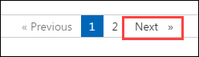

# **Advanced Analytics: From Models to Outcomes with Microsoft Fabric - Lab 2**


## Contents
- Introduction
    - Task 1: Setting Up and Exploring OneLake File Explorer
    - Task 2: Creating Reports with Power BI Desktop and Copilot
    - Task 3: Configuring VS Code for Microsoft Fabric Development
- Summary

## Introduction:

In this lab, you will explore the core tools and capabilities of Microsoft Fabric, including OneLake File Explorer, Power BI Desktop, and Visual Studio Code (VS Code) with the Synapse extension. You will learn how to access and manage your OneLake data directly from Windows File Explorer, build and analyze reports using Copilot in Power BI, and configure VS Code to develop and interact with Fabric artifacts and Lakehouse data. This hands-on lab is designed to provide a foundational understanding of how these tools integrate to support end-to-end data science and analytics workflows within the Microsoft Fabric ecosystem.

## Task 1: Setting Up and Exploring OneLake File Explorer

This application automatically syncs all Microsoft OneLake items that you have access to in Windows File Explorer. To log in to Microsoft OneLake File Explorer and explore its features.

1. On the Lab-vm, open the **Search bar** menu, type **OneLake** in the search bar, and select it from the search results.

    .png)

2. Upon launching, a login prompt will appear. Enter your email/username and click **Next**.

    - **Email/Username:** <inject key="AzureAdUserEmail"></inject>
   
      .png)
   
1. Now enter the following password and click on **Sign in**.
 
   - **Password:** <inject key="AzureAdUserPassword"></inject>

        .png)
   
1. When prompted with the **"Automatically sign in to all desktop apps and websites on this device?"** screen, click **Yes, all apps**.

    .png)

1. Once your account has been added successfully, you will see the **"You're all set!"** confirmation screen. Click **Done** to complete the login process.

    .png)

1. Navigate to the **File Explorer** located on the taskbar. On the left side of the File Explorer, click on **OneLake - Microsoft**, and then proceed to **ws-<inject key="Deployment ID" enableCopy="false"/>**. From there, go to **CustomersLH.Lakehouse** and select **Tables**. You should now be able to see the two tables folder.

    .png)

1. Navigate to the **ws-<inject key="Deployment ID" enableCopy="false"/>** folder. To **download a file**, simply double-click on it. If you need to sync changes made outside of File Explorer, **right-click** on the item or subfolder and select **Sync from OneLake**.

    .png)

You have successfully logged in to **Microsoft OneLake File Explorer** and explored its features. You can now manage your OneLake data directly from Windows File Explorer.

## Task 2: Creating Reports with Power BI Desktop and Copilot

1. Open the **Power BI Desktop** located on the desktop of your lab environment.

2. Once the "Enter your email address" dialog appears, copy the **Username** and paste it into the **Email** field of the dialog and select **Continue**.

   * Email/Username: <inject key="AzureAdUserEmail"></inject>

     .png)
  
3. On the Sign into Microsoft Azure tab, you will see the login screen, enter the following Email/ Username and then click on **Next**.

   * Email/Username: <inject key="AzureAdUserEmail"></inject>

     .png)

4. Now enter the following **Password** and click on **Sign in**.

    * Password: <inject key="AzureAdUserPassword"></inject>

      .png)

1. When prompted with the **"Automatically sign in to all desktop apps and websites on this device?"** screen, click **Yes, all apps**.

    .png)

1. Once your account has been added successfully, you will see the **"You're all set!"** confirmation screen. Click **Done** to complete the login process.

    .png)

1. Click the **File** menu to create a **Blank report** if one is not automatically created for you.

    .png)

1. Click on **Copilot** under the **Home** menu, then select the workspace **ws-<inject key="Deployment ID" enableCopy="false"/>** and click **OK**.

     .png)

1. Navigate to the **Home menu**, click **Get data**, and select **More...** to connect data from multiple sources.

      .png)

1. In the pop-up window, click **Microsoft Fabric** to choose the respective data stores. For this exercise, use **Power BI semantic models** and click **Connect**.

    .png)

1. In the **OneLake catalog** window, locate and select **ChurnDS** from the list of available semantic models.  

1. After selecting **ChurnDS**, click the **Connect** button in the bottom-right corner of the window to proceed.

    .png)

5. You can build the reports manually and use Copilot to suggest and create them based on your selection. Just follow along with Copilot's instructions and responses.

    .png)

    - Ask Copilot to Suggest content for a new report page.
    
        ***## Copilot Prompt or Press Respective Suggestions:***

        ```
        Suggest content for a new report page
        ```

    - Ask Copilot to create a report from the selection with your enhanced prompt.

        ***## Copilot Prompt or Press Create from the suggestions:***

        ```
        Create a page to examine the age distribution of customers.
        ```

## Task 3: Configuring VS Code for Microsoft Fabric Development

1. Open the **Visual Studio Code** located on the desktop of your lab environment.

1. Navigate to the **Extensions** in VS Code and search for **Fabric Data Engineering VS Code** to install it.

    .png)

1. Then, follow the sign-in Launch **Synapse** extension, Click **Select Workspace** and select **Set** in the popup window to set a local work folder. 

    .png)

    >**Note:** Click **Sign in** from the popu up window.

    .png)

1. If prompted, the sign-in process will occur in the browser window in the background. Please follow the sign-in steps as needed.

    .png)
    
1. Create a **New folder** named **FabricVSC** in the file explorer popup, and then **Select As Local Work Folder**.

    .png)

2. In VS Code, **Select** **Workspace** for the Synapse extension and choose the appropriate **ws-<inject key="Deployment ID" enableCopy="false"/>** from the dropdown menu.

    .png)

1. When prompted with the **Do you trust the authors of the files in this folder?** message, check the box labeled **Trust the authors of all files in the parent folder**. Click the **Yes, I trust the authors** button to enable all features and exit restricted mode in Visual Studio Code.

    .png)
   
1. Explore the Fabric Artifacts in your local VS Code IDE by **expanding the artifact types**.

    .png)
    
1. Launch the notebooks by clicking **Download**, then select **Open notebook folder**.

    .png)

3. To view the lakehouse table, navigate to **Lakehouse -> CustomersLH -> Tables -> df_pred_results**, then click on **Preview table**.

    .png)
    
1. To download the churn file, navigate to **Files -> churn -> raw -> churn.csv**, then click the **Download** icon next to the file to save it to your local directory.

    .png)

## Summary:

In this lab, you have explored the fundamental tools and features of Microsoft Fabric, including OneLake File Explorer, Power BI Desktop, and Visual Studio Code with the Synapse extension. You accessed and managed OneLake data through Windows File Explorer, built and analyzed reports using Copilot in Power BI, and configured VS Code to interact with Fabric artifacts and Lakehouse data. This lab provided a hands-on introduction to how these tools work together to enable end-to-end data science and analytics workflows within the Microsoft Fabric ecosystem.

Now, click on **Next** from the lower right corner to move on to the next page.



