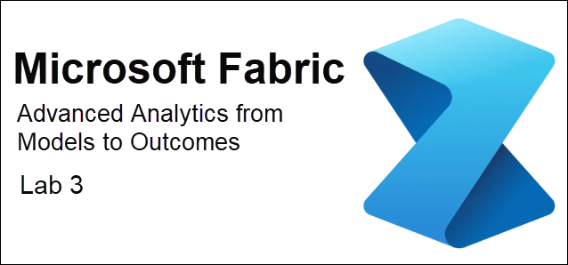

# **Advanced Analytics: From Models to Outcomes with Microsoft Fabric - Lab 3**



## Introduction
In this lab, you'll use Copilot in a Microsoft Fabric Data Science notebook to build a complete machine learning workflow, from loading data to model training, using natural language prompts.

**ATTENTION**: *AI-generated code may contain errors or unintended operations. Carefully review the code in this cell before running it.*

Let's create a **new notebook** from the **Lakehouse** Explorer and dive into the **Copilot** Data Science notebook experience.

1. On the Fabric/Powerbi portal, click on the **ws-<inject key="Deployment ID" enableCopy="false"/>** workspace and select the **CustomersLH** Lakehouse.

    .png)

2. On the **Home** tab, click on **Open notebook**, then select **New notebook**.

    .png)

4. After successful creation of sample notebook, you may explore the tour by clicking **Show me** or **Skip tour**.

    .png)

2. After creating a new notebook, expand the Lakehouses to view tables and files, then click on **Copilot** in the notebook ribbon.

    .png)

1. Click on **Get Started** in the Copilot chat window. You'll notice a new cell added at the top of the notebook, which is essential for activating Copilot in the notebook. Make sure to **execute this first cell to activate Copilot** and allow it to understand the notebook's context.

   .png)

3. Expand your **Lakehouse** and the **Files** used in the previous excercise. After successfully executing the first cell, right click on **churn.csv** and select **Load data**, then **Spark**.

    .png)

1. Load the **churn.csv** and displays the records.

    .png)
    
4. Enter the following prompt in Copilot to analyze and get insights about the data.

    ***## Copilot Prompt:***

    `Analyze df and provide insights about the data`

    .png)

5. **Generate Code with Natural Language Instructions**:

    Use the `%%code` magic command to write natural language instructions to generate code.

    ***## Copilot Prompt:***

    ```python
    %%code
    Load churn.csv from the Files folder into a pandas dataframe and then print the first 5 records
    ```

    .png)

6. **Use Copilot Chat Pane**:

    You can also ask the same instruction in the **Copilot Chat pane** on the right side. Once the code is generated, copy and add it to the notebook.

    ***## Copilot Prompt:***
    ```
    Generate a code for calculating the percentage of customers who have churned in the dataset and display the results.
    ```

    .png)

    Alternatively, you can continue using the `%%code` magic **within the notebook cell**.

    ***## Copilot Prompt:***

    ```
    %%code
    Generate a code for calculating the percentage of customers who have churned in the dataset and display the results.
    ```
    
7. **Data Cleansing**:

    Perform Data Cleansing with the help of Copilot.

    ***## Copilot Prompt:***

    ```
    %%code
    delete null values and duplicate values from the df dataframe. Drop columns 'RowNumber', 'CustomerId', 'Surname' from the df dataframe
    ```

    .png)

8. **Perform Exploratory Data Analysis**:

    Show data distributions using Copilot.
   
    ***## Copilot Prompt:***

    ```python
    %%code
    show the data distribution from all features in the df dataframe as charts
    ```

    .png)

    Create a correlation chart using Copilot. 
   
    ***## Copilot Prompt:***

    ```python
    %%code
    create a correlation chart with 'CreditScore', 'Age', 'Balance', 'EstimatedSalary', 'Tenure', 'NumOfProducts', 'HasCrCard', 'IsActiveMember', 'Exited' features from the df dataframe
    ```

    .png)

9. **Feature Engineering**:

    ***## Copilot Prompt:***

    ```python
    %%code
    one hot encode Geography and Gender features from df
    ```

    .png)

    If you encounter an error, you can **regenerate** the result by running the prompt again or copy and paste the **error message into the Copilot chat** window to resolve it.

    .png)

10. **Model Training and Testing**:

    Train the random forest model using Copilot. 
   
    ***## Copilot Prompt:***

    ```python
    %%code
    create a random forest classification model for customer churn using the 'Exited' feature for prediction
    ```

    Create a confusion matrix using Copilot.
   
    ***## Copilot Prompt:***

    ```python
    %%code
    create a confusion matrix
    ```

## Summary  

In this lab you created a notebook, loaded the **churn.csv** dataset, cleaned and explored the data, performed feature engineering, and trained a Random Forest model all with Copilot's help, streamlining the data science process with AI-assisted code generation.

You have successfully completed the lab.
