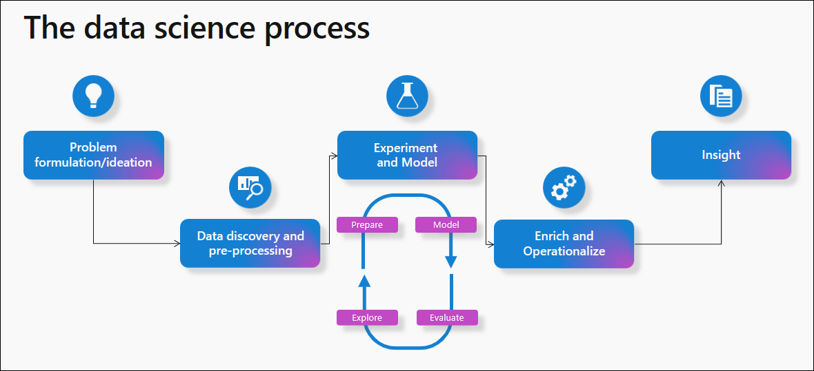
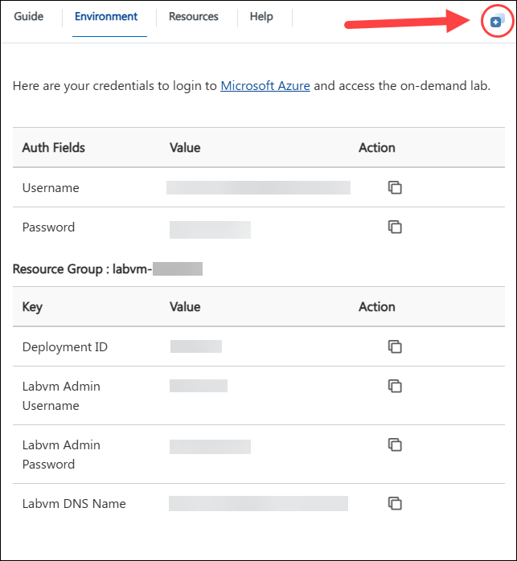
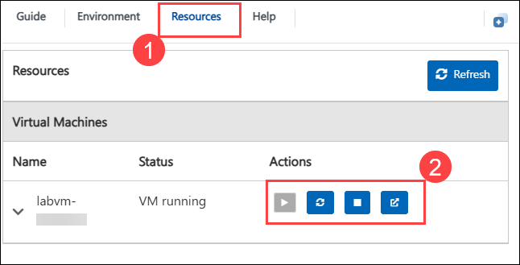
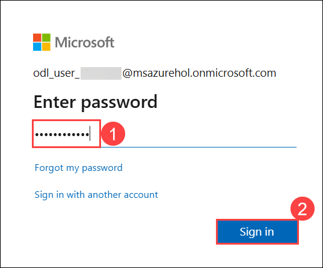
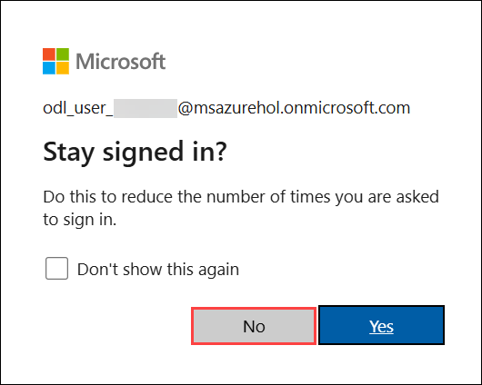

# **Advanced Analytics: From Models to Outcomes with Microsoft Fabric**

### Overall Estimated Duration: 90 Minutes

## Overview

This hands-on lab approach showcases how Microsoft Fabric streamlines the journey from models to real-world business impact, showcasing an end-to-end Synapse Data Science workflow in Microsoft Fabric. The scenario builds a model to predict whether or not bank customer’s churn. It demonstrates how to transform raw data into actionable insights using Advanced Analytics and Machine Learning. It guides users through data preparation, feature engineering, model training, and evaluation using tools like Fabric Data Wrangler, scikit-learn, LightGBM, and MLflow for experiment tracking. The tutorial also covers model deployment and visualization in Power BI, ensuring businesses can predict churn, take proactive actions, and improve customer retention. 

## Architecture

The data science process begins with **Problem formulation**, where collaboration is key, and Microsoft Fabric enables seamless teamwork to define the problem. Next, for **Data discovery and preprocessing**, we use OneLake and Lakehouse integration to efficiently find and prepare the data. **Data exploration** follows, leveraging notebooks, Apache Spark, Python, and Data Wrangler to clean and analyze the data. For **ML modeling**, we apply PySpark, SparklyR, MLflow, and SynapseML to build scalable machine learning pipelines. In the **Enrichment** phase, we perform batch scoring and use Spark Predict for scalable predictions. Finally, **Insights** are generated by writing predictions to OneLake, which can be directly fed into Power BI for visualization and sharing.

## Architecture Diagram



## Explanation of Components

The architecture for this lab involves the following key components:

1. **Problem Formulation**: Microsoft Fabric helps teams collaborate seamlessly, allowing for clear problem definition and shared understanding of goals.

2. **Data Discovery and Preprocessing**: Fabric integrates OneLake and Lakehouse for efficient data discovery and preprocessing. You can use notebooks and data pipelines to clean, transform, and structure the data.

3. **Data Exploration**: With tools like Apache Spark, Python, and Data Wrangler, you can explore and clean the data. This step helps you understand trends and patterns.

4. **Experimentation and ML Modeling**: Fabric supports machine learning using PySpark, SparklyR, and tools like MLflow for experiment tracking. You can build scalable ML models with SynapseML.

5. **Enrichment and Operationalization**: Once the models are built, Fabric allows batch scoring and scalable predictions using Spark Predict.

6. **Gaining Insights**: After predictions are made, results are stored in OneLake and can be directly visualized in Power BI for easy sharing and actionable insights.

This streamlined process enables end-to-end data science from problem definition to actionable insights.

## Getting Started with the Lab
 
Welcome to your Advanced Analytics from Models to Outcomes with Microsoft Fabric workshop! We've prepared a seamless environment for you to explore and learn about Azure services. Let's begin by making the most of this experience:

## Accessing Your Lab Environment
 
Once you're ready to dive in, your virtual machine and guide will be right at your fingertips within your web browser.
 
.png)

## Virtual Machine & Lab Guide
 
Your virtual machine is your workhorse throughout the workshop. The lab guide is your roadmap to success.
 
## Exploring Your Lab Resources
 
To get a better understanding of your lab resources and credentials, navigate to the **Environment** tab.
 
.png)
 
## Utilizing the Split Window Feature
 
For convenience, you can open the lab guide in a separate window by selecting the **Split Window** button from the Top right corner.
 

 
## Managing Your Virtual Machine
 
Feel free to start, stop, or restart your virtual machine as needed from the **Resources** tab. Your experience is in your hands!
 


## Lab Guide Zoom In/Zoom Out

To adjust the zoom level for the environment page, click the **A↕ : 100%** icon located next to the timer in the lab environment.


## Let's Get Started with Power BI Portal

1. Once the lab is ready, **"Choose privacy settings for your device"** screen will appear and click **Accept** to continue.

   .png)
 
1. On the Lab VM, open **Microsoft Edge** from the desktop. In a new tab, navigate to **Microsoft Fabric** by copying and pasting the following URL into the address bar:

   ```
   https://app.fabric.microsoft.com/home
   ```

2. On the **Enter your email, we'll check if you need to create a new account** tab you will see the login screen, in that enter the following email/username, and click on **Submit**.
 
   - **Email/Username:** <inject key="AzureAdUserEmail"></inject>
 
     .png)
 
3. Now enter the following password and click on **Sign in**.
 
   - **Password:** <inject key="AzureAdUserPassword"></inject>
 
     
     
1. If you see the pop-up **Stay Signed in?**, select **No**.

   

1. On Welcome to the Fabric view dialog opens, click **Cancel**.

    

1. On Microsoft Fabric (Free) license assignment dialog appears, click **OK** to proceed.

   .png)

1. You will be navigated to the **Microsoft** **Fabric Home page**.

    

    >**Note:** If you receive any pop-ups, please **Close** them.

    .png)
   
## Support Contact
 
The CloudLabs support team is available 24/7, 365 days a year, via email and live chat to ensure seamless assistance at any time. We offer dedicated support channels tailored specifically for both learners and instructors, ensuring that all your needs are promptly and efficiently addressed.

Learner Support Contacts:
- Email Support: cloudlabs-support@spektrasystems.com
- Live Chat Support: https://cloudlabs.ai/labs-support

Now, click on **Next** from the lower right corner to move on to the next page.
 


### Happy Learning!!
